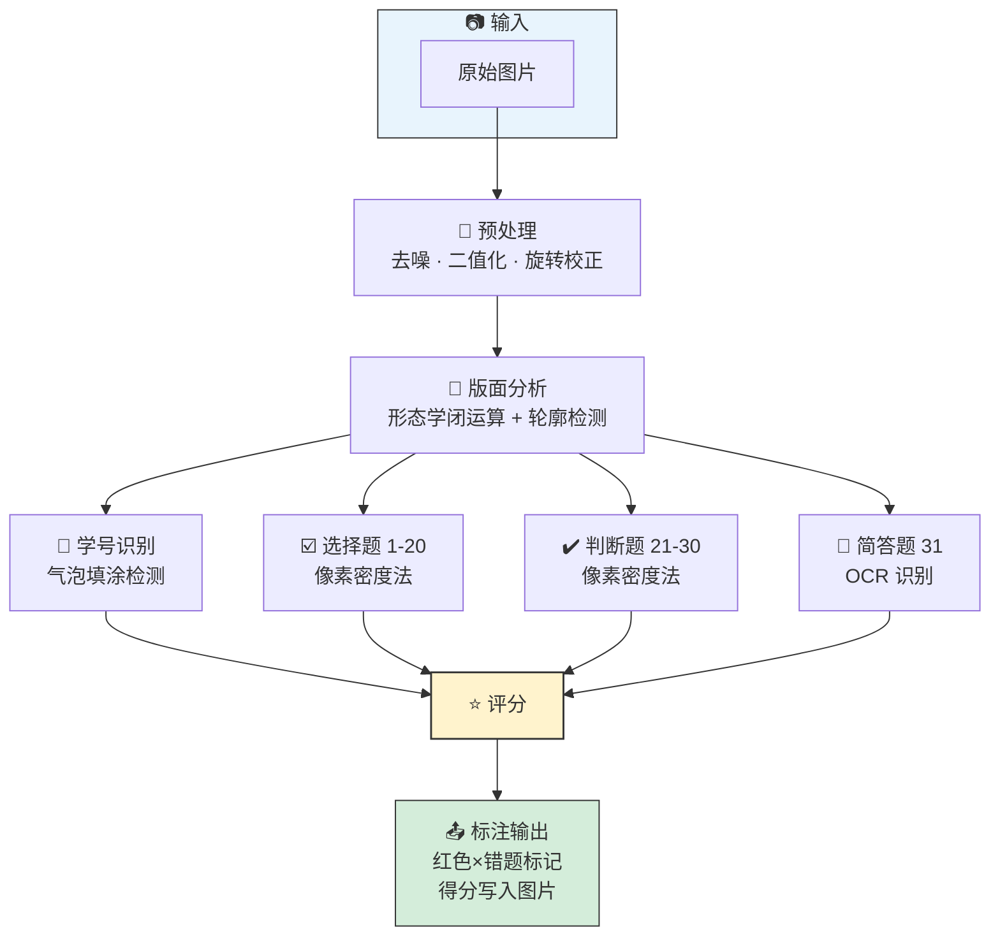

# 智能阅卷系统 — 课设项目

> 本项目实现一套基于计算机视觉的答题卡自动评分系统。
> 系统从图像预处理出发，依次完成学号识别、选择题/判断题填涂识别、简答题 OCR，最后进行答案比对与评分。
> 9 个骨架模块需要你根据提示实现，其他模块已提供完整代码。

---

## 快速上手

```bash
# 1. 克隆本仓库
git clone https://github.com/hbnnwwt/cv_wei.git

# 2. Windows：一键安装依赖（创建虚拟环境 + 安装全部依赖）
setup.bat

# 3. 启动 GUI（双击 run_gui.bat 或命令行）
run_gui.bat
# 或
streamlit run app.py

# 4. 或者使用 CLI
python main.py --help
```

---

## 目录结构

```
code/base/
├── app.py                     # Streamlit GUI（已完整提供）
├── main.py                    # CLI 入口（已完整提供）
├── run_gui.bat                # 一键启动 GUI（已完整提供）
├── run_tests.bat              # 一键运行测试（已完整提供）
├── answer-sheet.html          # 答题卡模板，可打印后填涂
├── requirements.txt           # Python 依赖
├── setup.bat                  # Windows 环境安装脚本
├── config/
│   ├── sheet_layout.json      # 答题卡布局参数（题号范围、网格大小）
│   ├── model_config.json       # API 模型配置（LLM/OCR）
│   ├── api_keys.json.example   # API 密钥模板（复制为 api_keys.json）
│   └── llm_grading_prompt.txt # LLM 评分提示词模板
├── modules/
│   # ===== 以下模块已完整提供，直接使用 =====
│   ├── defaults.py             # 常量与路径（无需修改）
│   ├── pipeline.py             # 管线编排（连接各模块的胶水代码）
│   ├── marker.py               # 错题可视化标注（红色 × 标记错题）
│   ├── llm_essay_grader.py    # LLM 评分（加分项，已有完整实现）
│   ├── config_validator.py     # 配置验证（无需修改）
│   └── __init__.py            # 包导出
│   # ===== 以下模块需要你实现 =====
│   ├── preprocess.py           # 图像预处理
│   ├── layout.py               # 版面分析
│   ├── bubble_base.py          # 气泡识别基类（供你调用）
│   ├── student_id_recognizer.py  # 学号识别
│   ├── choice_recognizer.py      # 选择题识别
│   ├── judge_recognizer.py       # 判断题识别
│   ├── essay_recognizer.py       # 简答题 OCR
│   └── grading.py                # 评分逻辑
├── views/                    # Streamlit 页面组件（已完整提供）
│   ├── single_view.py
│   ├── batch_view.py
│   └── components.py
├── tests/                    # 单元测试（已完整提供）
│   ├── test_preprocess.py
│   ├── test_layout.py
│   ├── test_student_id_recognizer.py
│   ├── test_choice_recognizer.py
│   ├── test_judge_recognizer.py
│   ├── test_essay_recognizer.py
│   ├── test_grading.py
│   └── ...
└── data/
    ├── answer_sheets/            # 示例答题卡图片（4张+6张测试集）
    └── GT/                       # Ground Truth 标准答案
```

---

## 系统架构



- **预处理**（需实现）：灰度化、去噪、OTSU二值化、旋转校正
- **版面分析**（需实现）：定位学号区、选择题区、判断题区、简答区
- **学号/选择题/判断题识别**（需实现）：气泡填涂检测，像素密度法
- **简答题 OCR**（需实现）：调用 OCR 引擎识别手写文字
- **评分**（需实现）：答案比对，生成报告

---

## 你需要实现什么

系统有 **9 个骨架模块**，每个模块对应一个独立算法挑战。每个骨架文件包含接口定义和"思路提示"（启发式问题，不给步骤），帮助你思考算法原理后再动手实现。

### 模块 1：学号识别 `student_id_recognizer.py`

**接口：**
```python
rec = StudentIdRecognizer(digit_count=10, threshold=0.3)
student_id = rec.recognize(roi)           # → str，如 "2025811008"
student_id, viz, details = rec.recognize_with_viz(roi)  # → 可视化版本
```

**核心挑战：** 轮廓检测 → 网格分割 → 逐列填充率分析

---

### 模块 2：选择题识别 `choice_recognizer.py`

**接口：**
```python
rec = ChoiceRecognizer(threshold=0.06)
result = rec.recognize_all_with_viz(roi, question_count=20, fixed_grid=(5, 4))
# result['answers'] = {1: 'A', 2: 'C', 3: None, ...}
```

**核心挑战：** 连通域气泡定位 → 固定网格切分 → 填充率比较 → 多选检测

---

### 模块 3：判断题识别 `judge_recognizer.py`

**接口：**
```python
rec = JudgeRecognizer(threshold=0.06)
result = rec.recognize_all_with_viz(roi, question_count=10, rows_n=3, cols_n=4)
# result['answers'] = {21: 'T', 22: 'F', ...}
```

**核心挑战：** 与选择题相同，但只有 T/F 两个选项，填涂密度更高

---

### 模块 4：简答题 OCR `essay_recognizer.py`

**接口：**
```python
rec = EssayRecognizer(engine='paddleocr')
text = rec.recognize(roi)  # → str，识别到的文字
```

**核心挑战：** OCR 引擎集成（至少一种：paddleocr / easyocr / rapidocr）

---

### 模块 5：评分逻辑 `grading.py`

**接口：**
```python
svc = GradingService(answer_key, choice_score=3, judge_score=2, essay_max_score=20)
result = svc.grade({'choice': {1:'A',2:'C'}, 'judge': {21:'T'}, 'essay': {31:'文字'}})
report = svc.generate_report(result)
```

**核心挑战：** 答案比对 → 计分 → 格式化报告生成

---

### 模块 6-9：预处理与版面分析

| 模块 | 核心方法 | 课程周次 |
|------|---------|---------|
| `preprocess.py` | `load` / `detect_orientation` / `binarize` / `process` | week03-05 |
| `layout.py` | `_detect_regions` / `analyze` | week05-06 |
| `bubble_base.py` | `_analyze_zones` / `recognize_with_viz` | week05-06 |
| `grading.py` | `grade` / `generate_report` | — |

---

## 逐模块验证

```bash
# 学号识别
python -c "
from modules.student_id_recognizer import StudentIdRecognizer
import cv2
img = cv2.imread('data/answer_sheets/answer_sheet_1.png')
rec = StudentIdRecognizer()
try:
    print(rec.recognize(img[:, :300, :]))
except NotImplementedError as e:
    print('未实现:', e)
"

# 选择题识别
python -c "
from modules.choice_recognizer import ChoiceRecognizer
import cv2
img = cv2.imread('data/answer_sheets/answer_sheet_1.png')
rec = ChoiceRecognizer()
try:
    r = rec.recognize_all_with_viz(img, question_count=20, fixed_grid=(5, 4))
    print(r['answers'])
except NotImplementedError as e:
    print('未实现:', e)
"

# 评分逻辑
python -c "
from modules.grading import GradingService
svc = GradingService({'choice': {1:'A',2:'B'}, 'judge': {}, 'essay': {}})
try:
    r = svc.grade({'choice': {1:'A',2:'C'}, 'judge': {}, 'essay': {}})
    print(r)
except NotImplementedError as e:
    print('未实现:', e)
"
```

---

## 提交答案键格式

将标准答案保存为 `参考答案.xlsx`，格式：

|      | 1    | 2    | ... | 21   | 22   | ... | 31   |
|------|------|------|-----|------|------|-----|------|
| 答案 | A    | C    | ... | T    | F    | ... | 参考文本 |

- 第1行：题号（1, 2, ..., 21, 22, ..., 31）
- 第2行：标准答案
- 选择题填 `A/B/C/D`，判断题填 `T/F`，简答题填参考文本

---

## 测试与自动化

### 测试数据

- **`data/answer_sheets/`** — 示例答题卡图片（4张，可用于测试）
- **`data/GT/`** — Ground Truth 标准答案（各题型的标准答案文件）
- **`data/参考答案.xlsx`** — 参考答案 Excel 格式

### 运行测试

**Windows 双击运行：**
```bash
run_tests.bat
```

**或手动运行 pytest：**
```bash
pytest tests/ -v
```

**单独运行某个测试：**
```bash
pytest tests/test_student_id_recognizer.py -v
pytest tests/test_grading.py -v
```

### 测试覆盖

| 测试文件 | 测试内容 |
|---------|---------|
| `test_preprocess.py` | 图像预处理（灰度化、二值化、旋转校正） |
| `test_layout.py` | 版面分析（区域定位） |
| `test_student_id_recognizer.py` | 学号识别 |
| `test_choice_recognizer.py` | 选择题识别 |
| `test_judge_recognizer.py` | 判断题识别 |
| `test_essay_recognizer.py` | 简答题 OCR |
| `test_grading.py` | 评分逻辑 |
| `test_pipeline.py` | 整体管线流程 |
| `test_marker.py` | 错题标注功能 |
| `test_llm_essay_grader.py` | LLM 评分模块 |

### 预期结果

- 模块未实现时，对应测试会显示 `NotImplementedError` 或 `FAILED`
- 逐个实现模块后，测试会从 FAIL → PASS
- 全部实现后，所有测试应通过

### 验证实现正确性

```bash
# 用示例图片验证学号识别
python -c "
from modules.student_id_recognizer import StudentIdRecognizer
import cv2
img = cv2.imread('data/answer_sheets/answer_sheet_1.png')
roi = img[:, :300, :]
rec = StudentIdRecognizer()
print(rec.recognize(roi))
"

# 用示例图片验证选择题识别
python -c "
from modules.choice_recognizer import ChoiceRecognizer
import cv2
img = cv2.imread('data/answer_sheets/answer_sheet_1.png')
roi = img[100:500, 200:800, :]
rec = ChoiceRecognizer()
print(rec.recognize_all_with_viz(roi, question_count=20, fixed_grid=(5, 4)))
"
```

---

## 常见问题

### Q1: `app.py` 启动后显示"未实现"警告，但没崩溃，是正常的吗？
**A:** 正常。这是骨架模板的预期行为。你每实现一个模块，对应的识别/评分功能就会激活。

---

### Q2: 应该先实现哪个模块？
**A:** 建议顺序：学号识别 → 选择题识别 → 判断题识别 → 评分逻辑 → 简答题 OCR。
学号识别最独立（只依赖图像区域坐标），适合作为第一个任务。

---

### Q3: 如何调试某个模块？
**A:** 使用 `recognize_with_viz` 版本（如果提供了的话），它会返回带标注的可视化图像：
```python
student_id, viz, details = rec.recognize_with_viz(roi)
cv2.imwrite('debug_viz.png', viz)
```

---

### Q4: 多选检测是什么？
**A:** 当学生同时填涂了两个及以上选项时，判定为无效答题。
`BubbleRecognizerBase` 已实现了多选检测逻辑，你只需在 `recognize_all_with_viz` 中调用它。

---

### Q5: fork 后如何开始？
**A:**
1. `git clone` 你 fork 的仓库
2. 运行 `setup.bat` 安装依赖
3. 运行 `streamlit run app.py` 确认能启动
4. 从学号识别开始，逐个模块实现

---

### Q6: OCR 引擎怎么选？安装失败怎么办？
**A:** 推荐 `paddleocr`（对中文手写体效果最好）。如果安装失败，可以换 `easyocr` 或 `rapidocr`。
切换方式：修改 `pipeline.py` 中的 `ocr_engine` 参数为 `'easyocr'` 或 `'rapidocr'`。

---

### Q7: threshold 参数怎么调？
**A:** `0.06` 是默认值，适合正常填涂。如果识别结果不稳定（漏填/误判），可以调高到 `0.08`（更严格）或调低到 `0.04`（更宽松）。调完后用示例图片测试，观察哪些题容易出错。

---

### Q8: 识别结果全是 None，是怎么回事？
**A:** 大概率是**预处理或版面分析未实现**，导致区域坐标提取失败。检查：
1. `preprocess.py` 的 `process()` 方法是否返回了正确的二值化图像
2. `layout.py` 的 `analyze()` 方法是否返回了正确的区域坐标
3. `pipeline.py` 中的 `preprocess_and_analyze()` 是否正确调用了这两个方法

---

### Q9: 学号识别返回问号或空值怎么办？
**A:**
1. 检查 ROI 区域是否正确（学号应该在图片左侧，宽度约占 1/4）
2. 打印 `roi` 看图像是否有效（不是全黑/全白）
3. 尝试调高 `threshold`（比如 `0.4`）或调低
4. 检查是否需要先对 ROI 做灰度化和二值化处理

---

### Q10: 图片上下颠倒能自动检测吗？
**A:** 可以通过**旋转校正**实现。`preprocess.py` 的 `detect_orientation()` 方法可以根据内容密度判断是否需要翻转 180°。
如果拍反了但系统没有处理，检查 `correct_orientation()` 是否正确实现了。

---

### Q11: 简答题参考文本怎么写格式？
**A:** 参考文本不需要完全匹配学生答案的每个字。OCR 本身有误差，系统会用语义评判而非字符匹配。
写参考文本时抓住核心关键词即可，例如："图像预处理的作用是去噪和增强对比度"。

---

### Q12: 填涂太淡/太重识别不准怎么办？
**A:** 这是**图像预处理**的问题。在 `binarize()` 中：
- 太淡：调低二值化阈值，或改用自适应阈值（adaptive threshold）
- 太重：调高二值化阈值，或先做降噪（denoise）
- 也可以在 `denoise()` 前加 CLAHE 对比度增强
调完后用同一张图测试，观察填涂区域像素分布是否集中。
